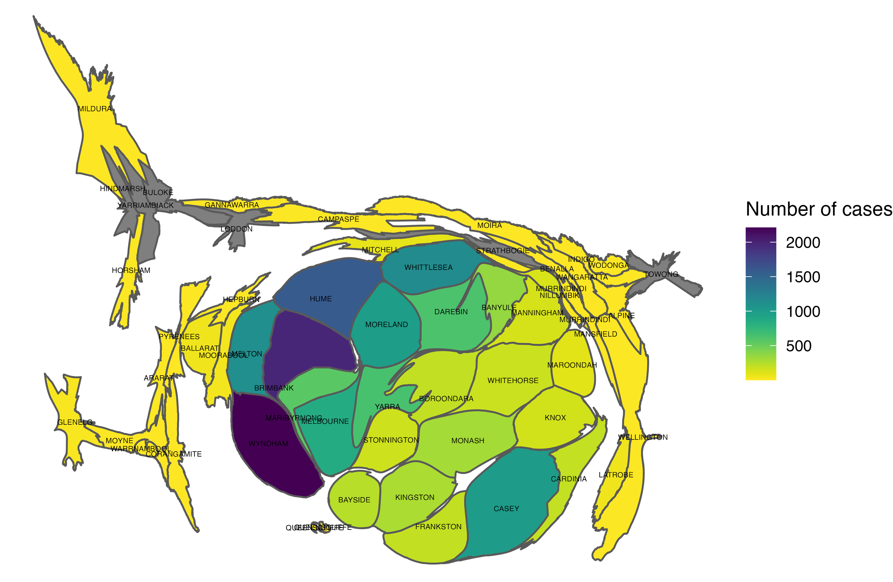

```{r, setup, include=FALSE}
knitr::opts_chunk$set(echo = FALSE, message = FALSE, warning = FALSE)
```

```{r}
library(tidyverse)
library(lubridate)
library(sf)
library(ggplot2)
library(cartogram)
library(leaflet)
library(readxl)
library(plotly)
library(viridis)
library(xaringanExtra)
```

```{r xaringan-panelset, echo=FALSE}
xaringanExtra::use_panelset()
```


class: center, bottom

background-size: 100%

background-image: url("image/cover.jpg")

background-position: top

# COVID-19 in Victoria

## Shaine, Smriti, Sitha

## Monash University

### `r Sys.Date()`

<br>
Image credit: [Taiwan Centers for Disease Control](https://www.cdc.gov.tw/En)
---

class: bottom

background-size: 100%

background-image: url("image/topic.jpg")

background-position: top

# How are the COVID-19 cases spreading in the Victorian community during 1st May to 30th September in 2020?

<br>
Image credit: [PAHO](https://www.paho.org/en/news/26-1-2021-who-calls-experts-covid-19-technical-advisory-group)
---
class: bottom

background-size: 100%

background-image: url("image/intro.jpg")

background-position: top

# What is Covid-19
- An infectious disease caused by coronavirus 
- brought a pandemic to the world since late 2019. 
- Up to October 2021, more than 240 millions confirmed cases and 5 millions deaths have been reported   

**On average, it takes 5–6 for symptoms to show, including:**   
- tiredness
- dry cough
- headache
- fever

<br>
Image credit: [IMF](https://www.tuvsud.com/zh-tw/covid-19-precautionary-measures)
---
```{r xaringanExtra, echo=FALSE}
xaringanExtra::use_panelset()
```


```{r data}
vic_cases <- read_csv("data/NCOV_COVID_Cases_by_LGA_20211016.csv")
vic_cases_source <- read_csv("data/NCOV_COVID_Cases_by_LGA_Source_20211015.csv")

# Filter for dates

vic_cases <- vic_cases %>%
  filter(diagnosis_date >= "2020-05-01" & diagnosis_date <= "2020-09-30")

vic_cases_source <- vic_cases_source %>%
  filter(diagnosis_date >= "2020-05-01" & diagnosis_date <= "2020-09-30")


vic_cases_aggregate <- vic_cases %>%
  mutate(Localgovernmentarea = sapply(strsplit(vic_cases$Localgovernmentarea,
                                               split=' ',
                                               fixed=TRUE),
                                      function(x) (x[1]))) %>%
  group_by(Localgovernmentarea) %>%
  tally() %>%
  mutate(NAME = toupper(Localgovernmentarea))

```

```{r map, results='hide'}

vic_map <- st_read(dsn = "data/Order_T8YRCY/ll_gda2020/esrishape/whole_of_dataset/victoria/VMADMIN/AD_LGA_AREA_POLYGON.shp")


vic_map_postcode <- st_read(dsn = "data/Order_T8YRCY/ll_gda2020/esrishape/whole_of_dataset/victoria/VMADMIN/POSTCODE_POLYGON.shp")

```

.panelset[
.panel[.panel-name[Leaflet]
```{r eval = FALSE}
vic_map_postcode <- vic_map_postcode %>% 
  mutate(Postcode = as.numeric(POSTCODE))

cases <- vic_cases_source %>% 
  group_by(Postcode) %>% 
  tally() 

vic_map_postcode <- left_join(vic_map_postcode, cases)

# This is the leaflet plot
pal_fun <- colorQuantile("viridis", vic_map_postcode$n, n = 6, na.color = "white", reverse = TRUE)

p_popup <- paste0("<strong>LGA</strong> : ", vic_map$OFFICIALNM)

markers <- data.frame(postcode = c("3045", "3062", "3002", "3427", "3027"),
                      description = c("Postcode: 3045, Melbourne International Airport", "Postcode: 3062, Somerton Power Station", "Postcode: 3002, Melbourne Cricket Ground & Fitzroy Garden", "Postcode: 3427, Diggers Rest", "Postcode: 3027, RAAF Base Williams"),
                      longitude = c(144.8447, 144.9539, 144.97931, 144.721111, 144.7437),
                      latitude = c(-37.6638, -37.6338, -37.815083, -37.628056, -37.9316))
                  

leaflet <- leaflet(vic_map_postcode) %>%
  addPolygons(
    color = 'grey',
    weight = 2,
    fillColor = ~pal_fun(n),
    fillOpacity= 0.7,
    smoothFactor = 0.5,
    stroke = FALSE,
    group = "postcode") %>%
  addPolygons(
    data=vic_map,
    weight = 2,
    fillOpacity = 0,
    color = "grey",
    group = "LGA",
    popup = p_popup) %>%
  addTiles() %>% 
  setView(lng = 144.964600, lat = -37.020100, zoom = 7) %>% 
     addMarkers(
        lng = ~longitude,
        lat = ~latitude,
        popup = ~description,
        layerId = ~postcode,
        data = markers
      ) 


f <- paste0("leaflet.html")
htmlwidgets::saveWidget(leaflet, f)
htmltools::tags$iframe(
    src=f,
    width="100%", 
    height="100%",
    scrolling="no", 
    seamless="seamless", 
    frameBorder="0"
  )
  
```
]

.panel[.panel-name[Analysis]
# Analysis
- The **boarder refers to the local government areas**   

- The **colors filled by the postcode**   

- **Local Government Area** names are abbreviated in the Local Government Area structure   

- **Postcodes** (POAs = Postal Areas)   

- Darker colors refer to higher number of cases confirmed, lighter refers to lower

- Some lighter colors are found surrounded by darker colors and those areas with lighter colors are not residential areas, examples are:   
1.Postcode: 3045, LGA: Hume is Melbourne International Airport   
2.Postcode: 3062, LGA: Hume is Somerton Power Station   
**For further details, please refer to the the Map**
]
]
---

.panelset[
.panel[.panel-name[check]
Let's just try
```{r eval = FALSE}
.panelset[
.panel[.panel-name[Cartogram Map]
```{r echo=FALSE, out.height=600, out.width= 600}

```
]


.panel[.panel-name[Bar Plot]
```{r}

pop <- read_excel(path = "data/32180ds0002_2017-18.xls",
                  sheet = "Table 2",
                  skip = 7)

pop <- pop %>%
  select(`Local Government Area`, no....4) %>%
  na.omit()

pop <- pop %>%
  mutate(NAME = sapply(strsplit(pop$`Local Government Area`,
                                split=' ',
                                fixed=TRUE),
                       function(x) (x[1])),
         pop = no....4) %>%
  select(NAME, pop) %>%
  mutate(NAME = toupper(NAME))

pop_cases <- pop %>%
  left_join(vic_cases_aggregate) %>%
  na.omit() %>%
  arrange(desc(pop)) %>%
  head(20)
  

ggplot(data = pop_cases, aes(y = reorder(NAME, pop))) +
  geom_bar(aes(x = n), stat="identity", position="identity", alpha=.8, fill='pink',
           color='red') +
  theme_minimal()

```
]
]


